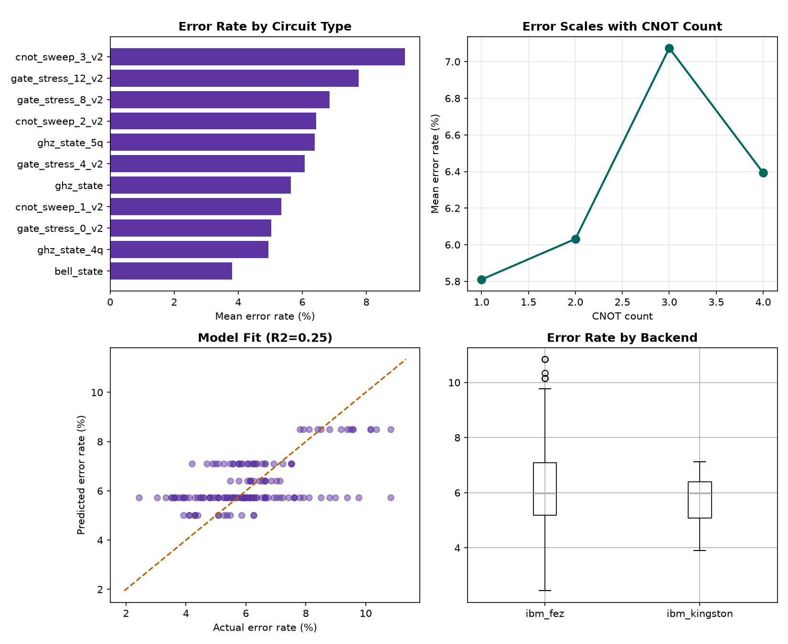
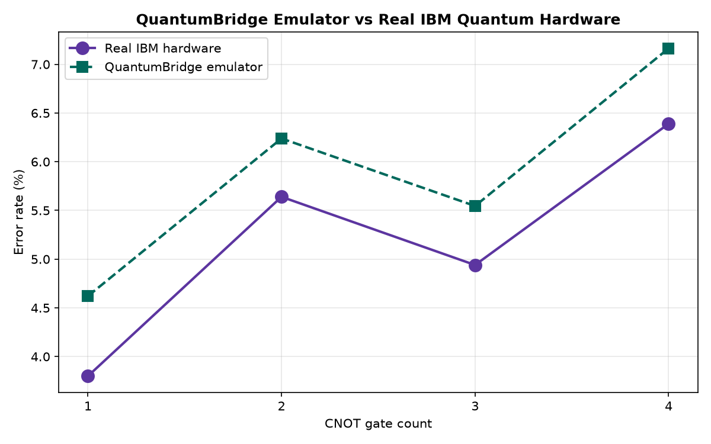

# QuantumBridge

**A machine learning-based quantum chip noise emulator — learning how real quantum hardware fails, so it can be simulated offline.**

Built from scratch by an undergraduate researcher, using real experiments on IBM Quantum hardware.

---

## The Problem

Real quantum computers are noisy. Access to them is limited, expensive, and requires cloud credentials most students and small research teams don't have. Simulators exist, but they simulate *ideal* qubits — not the noisy, imperfect ones that exist in the real world.

**QuantumBridge asks:** can we learn a real chip's noise behavior well enough to predict it — without needing to run every new circuit on real hardware?

## What This Project Has Done So Far

- Collected **165+ real measurements** from IBM Quantum hardware (`ibm_fez`, `ibm_kingston`) across 11 distinct circuit designs
- Discovered that quantum gate error is **not random noise** — it scales measurably with circuit structure:
  - Each additional **CNOT gate** costs ~1.6-1.8 percentage points of error
  - Each additional **single-qubit gate** costs ~0.22 percentage points — roughly 7-8x cheaper
  - Different physical chips have measurably different baseline noise levels
- Built and iteratively improved a **predictive noise model**, currently achieving **R² = 0.747** on held-out real hardware data (best validated version)
- Documented a complete, honest research process — including three separate confounding variables discovered and diagnosed in the data collection pipeline itself

## Key Result

```
error_rate = 3.003 + (1.618 × cnot_count) + (−2.311 × is_kingston)
```

A linear model using just two features — CNOT gate count and which chip a circuit runs on — explains ~75% of the variation in real hardware error rates.



## v1 Emulator — Validated

QuantumBridge now includes a working offline emulator: give it any Qiskit circuit
and a target chip, and it returns a realistic noisy result — without touching
IBM's cloud or using any quota.



| CNOTs | Backend | Real hardware | Emulator | Deviation |
|---|---|---|---|---|
| 1 | ibm_fez | 3.80% | 4.62% | 0.82 pts |
| 2 | ibm_fez | 5.64% | 6.24% | 0.60 pts |
| 3 | ibm_kingston | 4.94% | 5.55% | 0.61 pts |
| 4 | ibm_kingston | 6.39% | 7.16% | 0.77 pts |

**Average deviation: 0.70 percentage points** — within the natural run-to-run
variation of real quantum hardware itself (~1-2 points, see Entry 004). The
emulator shows a small, consistent upward bias (~0.7 pts) across all four
tested conditions, likely from the training data's session composition —
noted here rather than hidden, since a known small bias is more trustworthy
than an unexplained "perfect" result.

## Repository Structure

```
quantumbridge/
├── data/               # Raw and processed experiment data (CSV)
├── scripts/            # All data collection and analysis scripts
├── notebooks/          # Exploratory analysis
├── docs/               # Research log, charts, writeups
└── README.md
```

## Research Log

The full research log — 12 entries, every experiment, every mistake, every fix — is documented in [`docs/research_log.pdf`](docs/research_log.pdf). This is not a polished highlight reel; it includes methodology errors and how they were caught and corrected, because that's what real research looks like.

## Tech Stack

- **Qiskit** — quantum circuit construction and IBM hardware access
- **scikit-learn** — regression modeling
- **pandas / numpy** — data processing
- **matplotlib** — visualization

## Roadmap

- [ ] Complete factorial data collection (full CNOT × gate-count × backend coverage)
- [ ] Scale dataset toward 500+ samples
- [ ] Introduce Random Forest / Gradient Boosting once data justifies it
- [ ] Package as an installable, offline quantum noise emulator
- [ ] Long-term: unified interface routing circuits to either QuantumBridge's emulator or real quantum hardware — a "Quantum OS" for research use

## Author

Built by an undergraduate BTech AI/ML student as an independent research project, documenting the full journey from first quantum circuit to a working predictive model.

---

*This project is research-oriented and open for collaboration. If you're interested in quantum computing, noise modeling, or machine learning applied to physical systems, feel free to reach out.*
